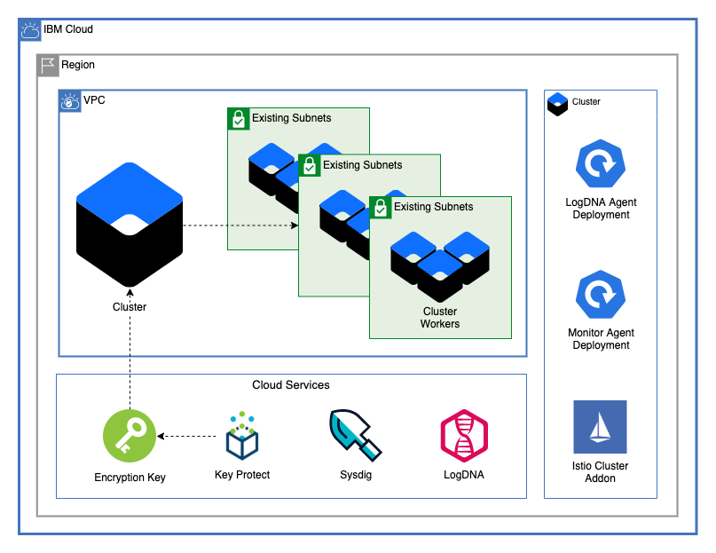

# VPC Cluster

This module deploys an IBM Cloud Kubernetes Cluster to an existing VPC. Once the cluster is created, this module installs LogDNA and Sysdig agents onto the cluster. Additionally, it can install any number of IBM Managed Kubernetes Addons to your cluster.

---

## Table of Contents

1. [Cluster](##Cluster)
2. [Worker Pools (Optional)](##Worker-Pools-(Optional))
3. [Resources](##Resources)
4. [Logging and Monitoring](##Logging-and-Monitoring)
5. [Verifying Installation](##verifying-installation)
6. [Module Variables](##module-variables)

---

## Cluster

This module allows for a cluster to be created accross any number of subnets in any number of zones within a single VPC. Optionally, public service endpoints on the cluster can be disabled to ensure that the public internet is not able to access the Kubernetes resources. For high availability, ensure your cluster has at least 2 workers per zone.

---

## Worker Pools (Optional)

This module allows the creation of any number of worker pools accross subnets. Worker pools can also be created in resource groups other than the one where the cluster is provisioned to limit access. Each worker pool can have a variable number of workers per zone.

---

## Resources

This module creates a LogDNA Instacne for cluster logging, a Sysdig Instance for cluster monitoring, and a IBM Key Protect instance for cluster encryption.

---

## Logging and Monitoring

Once the cluster has been provisioned, this module uses the Kubernetes Terraform Provider to install the nessecary LogDNA and Sysdig agents onto the cluster.

---

## Verifying Installation

To ensure that your Logging and Monitoring instances are working properly, check the `Logging` and `Monitoring` tabs at [https://cloud.ibm.com/observe/](https://cloud.ibm.com/observe/), find your instance, and check to make sure that the LogDNA and Sysdig services are connected to your cluster.

You can also use `kubectl get pods -n ibm-observe` on the command line to ensure that the pods are all running correctly.

---

## Module Variables

Variable                        | Type         | Description                                                                                                                                                                                                                                                                                                                                                                                                                                                                           | Default
------------------------------- | ------------ | ------------------------------------------------------------------------------------------------------------------------------------------------------------------------------------------------------------------------------------------------------------------------------------------------------------------------------------------------------------------------------------------------------------------------------------------------------------------------------------- |--------
ibmcloud_api_key                | string       | The IBM Cloud platform API key needed to deploy IAM enabled resources                                                                                                                                                                                                                                                                                                                                                                                                                 | 
ibm_region                      | string       | IBM Cloud region where all resources will be deployed                                                                                                                                                                                                                                                                                                                                                                                                                                 | 
resource_group                  | string       | Name for IBM Cloud Resource Group where resources will be deployed                                                                                                                                                                                                                                                                                                                                                                                                                    | 
unique_id                       | string       | A unique identifier need to provision resources. Must begin with a letter                                                                                                                                                                                                                                                                                                                                                                                                             | `"asset-test"`
vpc_name                        | string       | Name of VPC where cluster is to be created                                                                                                                                                                                                                                                                                                                                                                                                                                            | 
subnet_names                    | list(string) | List of subnet names                                                                                                                                                                                                                                                                                                                                                                                                                                                                  | `[]`
cluster_name                    | string       | Name of cluster to be provisioned                                                                                                                                                                                                                                                                                                                                                                                                                                                     | `"test-cluster-with-addons"`
machine_type                    | string       | The flavor of VPC worker node to use for your cluster                                                                                                                                                                                                                                                                                                                                                                                                                                 | `"bx2.4x16"`
workers_per_zone                | number       | Number of workers to provision in each subnet                                                                                                                                                                                                                                                                                                                                                                                                                                         | `2`
disable_public_service_endpoint | bool         | Disable public service endpoint for cluster                                                                                                                                                                                                                                                                                                                                                                                                                                           | `false`
kube_version                    | string       | Specify the Kubernetes version, including the major.minor version. To see available versions, run `ibmcloud ks versions`. To use the default, leave string empty                                                                                                                                                                                                                                                                                                                      | `""`
wait_till                       | string       | To avoid long wait times when you run your Terraform code, you can specify the stage when you want Terraform to mark the cluster resource creation as completed. Depending on what stage you choose, the cluster creation might not be fully completed and continues to run in the background. However, your Terraform code can continue to run without waiting for the cluster to be fully created. Supported args are `MasterNodeReady`, `OneWorkerNodeReady`, and `IngressReady`   | `"IngressReady"`
tags                            | list(string) | A list of tags to add to the cluster                                                                                                                                                                                                                                                                                                                                                                                                                                                  | `[]`
worker_pools                    |              | List of maps describing worker pools                                                                                                                                                                                                                                                                                                                                                                                                                                                  | `[]`
cluster_addons                  |              | A list of maps describing addons to be added to cluster                                                                                                                                                                                                                                                                                                                                                                                                                               | `[` `{` `name = "istio"` `},` `{` `name = "kube-terminal"` `version = "1.0.0"` `},` `{` `name = "cluster-autoscaler"` `}` `]`
service_endpoints               | string       | Service endpoints for resource instances. Can be `public`, `private`, or `public-and-private`                                                                                                                                                                                                                                                                                                                                                                                         | `"private"`
kms_plan                        | string       | Plan for Key Protect                                                                                                                                                                                                                                                                                                                                                                                                                                                                  | `"tiered-pricing"`
kms_root_key_name               | string       | Name of the root key for Key Protect instance                                                                                                                                                                                                                                                                                                                                                                                                                                         | `"root-key"`
kms_private_service_endpoint    | bool         | Use private service endpoint for Key Protect instance                                                                                                                                                                                                                                                                                                                                                                                                                                 | `true`
logdna_plan                     | string       | Plan for Databases for PostgreSQL                                                                                                                                                                                                                                                                                                                                                                                                                                                     | `"7-day"`
sysdig_plan                     | string       | Plan for Databases for PostgreSQL                                                                                                                                                                                                                                                                                                                                                                                                                                                     | `"graduated-tier"`